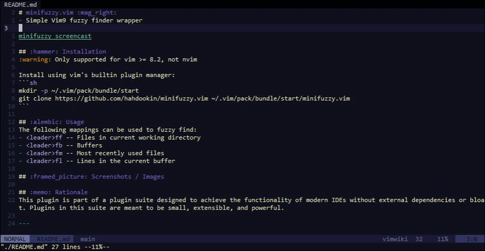

# minifuzzy.vim :mag_right:

- Simple Vim9 fuzzy finder wrapper
  forked from [hahdookin/minifuzzy.vim](https://github.com/hahdookin/minifuzzy.vim)



## :hammer: Installation

:warning: Only supported for vim >= 8.2, not nvim

Required [ **fd** ](https://github.com/sharkdp/fd/releases) binary in the `$PATH`

Install using vim's builtin plugin manager:

```sh
mkdir -p ~/.vim/pack/bundle/start
git clone https://github.com/hahdookin/minifuzzy.vim ~/.vim/pack/bundle/start/minifuzzy.vim
```

```vim
Plug 'AllanDowney/vim9-minifuzzy'
```

or

```vim
Plug 'hdookin/minifuzzy.vim'
```

## :alembic: Usage

The following mappings can be used to fuzzy find:

- `<leader>ff` -- Files in current working directory
- `<leader>fb` -- Buffers
- `<leader>fm` -- Most recently used files
- `<leader>fl` -- Lines in the current buffer

---

Issue #4

> A couple feature requests, posting all in here to avoid spamming multiple issues:
>
> - [x] Allow disabling all the default bindings via something like `g:minifuzzy#disable_default_mapping` so user can set up his own.
> - [x] Open selection in a new tab (via `ctrl-t` perhaps)
> - [ ] Search the _content_ of a git repo (akin to `git grep`)
> - [ ] Recursively search the content of the current directory. Something akin to `grep -Hnri`. This one is not as important for me as `git grep`.
